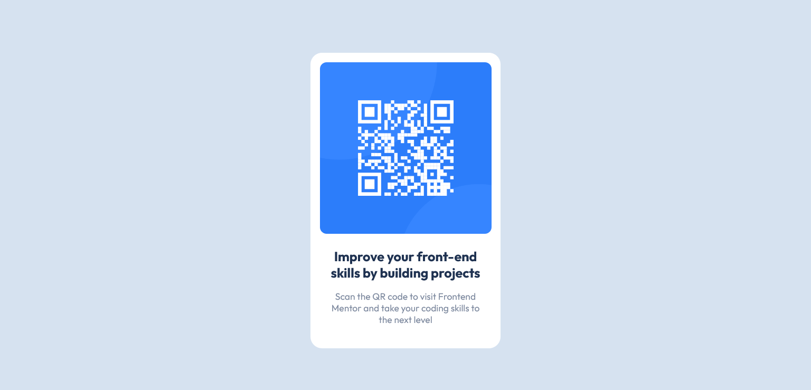

# Solución QR code component - Frontend Mentor 

Esta es mi solución al [Reto QR code component de Frontend Mentor](https://www.frontendmentor.io/challenges/qr-code-component-iux_sIO_H). 

## Índice

- [Información general](#información-general)
  - [Captura de pantalla](#captura-de-pantalla)
  - [Links](#links)
- [Tecnologías](#tecnologías)
  - [Creado con](#creado-con)
- [Autor](#autor)

## Información general

### Captura de pantalla

### Links

- Solution URL: [Add solution URL here](https://your-solution-url.com)
- Live Site URL: [Add live site URL here](https://your-live-site-url.com)

## Tecnologías

### Creado con

- HTML
- CSS

## Autor

- Mi Portafolio - [sergiomorales.dev](https://sergiomorales.dev)
- Frontend Mentor - [@Sergitxin22](https://www.frontendmentor.io/profile/Sergitxin22)