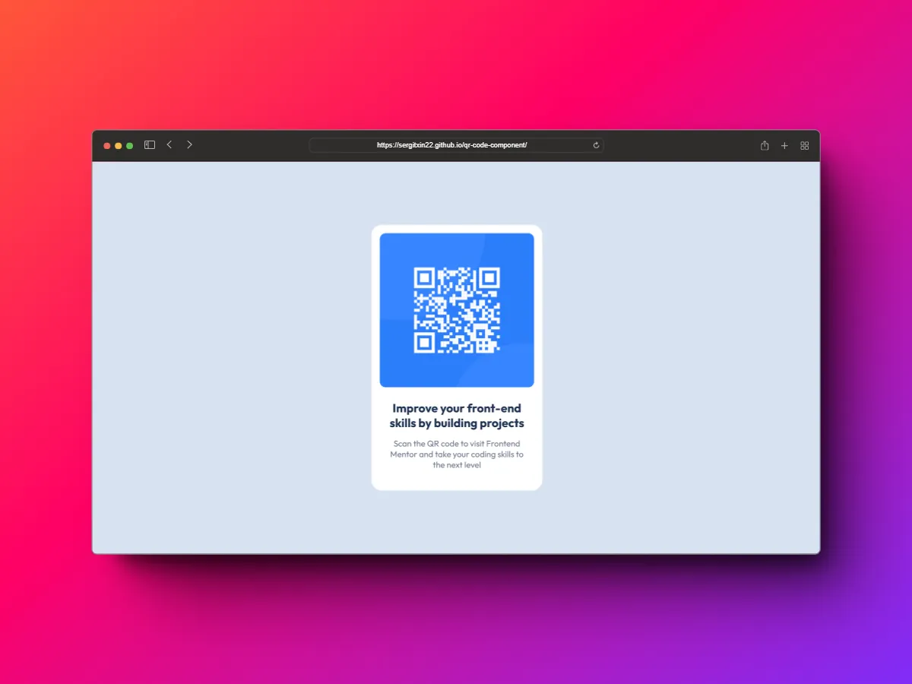

# Solución QR code component - Frontend Mentor 

Esta es mi solución al [Reto QR code component de Frontend Mentor](https://www.frontendmentor.io/challenges/qr-code-component-iux_sIO_H). 

## Índice

- [Información general](#información-general)
  - [Captura de pantalla](#captura-de-pantalla)
  - [Links](#links)
- [Tecnologías](#tecnologías)
  - [Creado con](#creado-con)
- [Autor](#autor)

## Información general

### Captura de pantalla

### Links

- URL de la solución: [frontendmentor.io](https://www.frontendmentor.io/solutions/qr-code-component-using-html-and-css-9DlR-ZykA)
- URL del proyecto: [sergitxin22.github.io/qr-code-component](https://sergitxin22.github.io/qr-code-component/)

## Tecnologías

### Creado con

- HTML
- CSS

## Autor

- Mi Portafolio - [sergiomorales.dev](https://sergiomorales.dev)
- Frontend Mentor - [@Sergitxin22](https://www.frontendmentor.io/profile/Sergitxin22)
